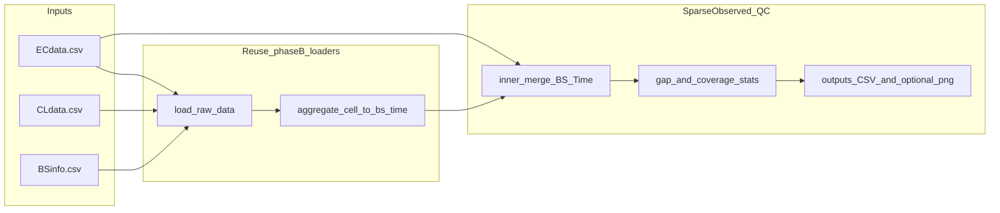

# 稀疏观测（策略 A）独立阶段目录

## 背景与约束

- 与你的 [model_description/chat-gpt-export-baseline-model.md](model_description/chat-gpt-export-baseline-model.md) 一致：`**Energy` 不插值**；监督仅使用 **EC 与 CL 内连接后真实存在的 (BS, Time)**。
- 现有实现参考：
  - Phase A：`ec.merge(bs_time, ..., how="inner")`，见 [phaseA_static_energy_20260413/run_phaseA_static_energy.py](phaseA_static_energy_20260413/run_phaseA_static_energy.py) 中 `merged` 构造。
  - Phase B：`panel = ec.merge(dynamic_features, ..., how="inner")`，见 [phaseB_dynamic_energy_20260414_rebuild/run_phaseB_dynamic_energy.py](phaseB_dynamic_energy_20260414_rebuild/run_phaseB_dynamic_energy.py) 的 `build_master_panel`；日内构造已用 `make_continuity_mask`（相邻点间隔须为 `horizon * 3600` 秒），但 **panel 层** 的 `rolling`/`shift` 仍为**按观测行**，与稀疏采样并存时需在文档与质检中显式说明。

## 新建目录与命名

- 路径建议：`[phase_sparse_observed_20260415/](phase_sparse_observed_20260415/)`（与现有 `phaseA_`* / `phaseB_*` 命名风格一致）。
- 子目录：`outputs/`（CSV、图），代码放根下少量模块，避免改动现有 Phase A/B 脚本（除非你后续明确要求合并进主线）。

## 交付内容

### 1. 主入口脚本 `run_sparse_observed_qc.py`

- **数据加载**：用 `importlib` 从 [phaseB_dynamic_energy_20260414_rebuild/run_phaseB_dynamic_energy.py](phaseB_dynamic_energy_20260414_rebuild/run_phaseB_dynamic_energy.py) 加载 `load_raw_data`、`aggregate_cell_to_bs_time`、`build_bs_static_features`（与 Phase A/B 同源，避免复制清洗逻辑）；若将来 Phase B 路径变更，只需改一处常量。
- **构造与 Phase 一致的 merged/panel**：
  - `merged`：`ec.merge(dynamic_features, on=["BS","Time"], how="inner")`（与 Phase A 相同口径）。
  - 可选再算与 Phase B 一致的 `panel`（多 merge `p_base` 会依赖 Phase A 输出 CSV；QC 以 **merged 层** 为主即可，`Energy` 稀疏性在 merged 已体现）。
- **输出 CSV**（写入 `phase_sparse_observed_20260415/outputs/`）：
  - `ec_coverage_by_bs.csv`：每站 EC 行数、时间 min/max、按时间排序后的 **间隔小时** 分布摘要（median/p90/max）、跨度内「若理想 1h 一格」的 **观测占比**（仅作参考指标，不生成插补格）。
  - `merged_gap_by_bs.csv`：merged 后同上 + **正则步长比例** `P(diff==1h)`（识别「 Mostly 连续 vs 极稀疏」）。
  - `bs_below_hour_threshold.csv`：列出 `n_obs < 24` 的 BS（与 baseline 文档中「少样本站可剔除」阈值对齐，列名可配置）。
  - `global_summary.json` 或单行 `run_summary.csv`：总站数、merged 行数、全局间隔分布，便于论文附录一张表。

### 2. 小模块 `sparse_time_utils.py`（纯函数、无 I/O）

- `hours_since_prev_obs(series: pd.Series)`：按时间排序后对 `Time` 做 `diff`，输出小时数（用于后续若要在特征中加 `gap_hours` / mask，而不改 Energy）。
- `contiguous_run_id(times)`：对同一 BS 内 `diff>1h` 处分段，便于可视化或分段统计。
- 模块顶 **docstring** 写清策略 A 与「行序 shift ≠ 日历滞后」的注意事项（满足你不另写散落 md 的偏好）。

### 3. 可选诊断图 `plot_sparse_energy_example.py` 或由主脚本 `--plot-bs B_0` 触发

- 读取 merged 中指定 BS 的一周 `Energy`–`hour` 曲线；**不插补**：在间隔 `>1h` 处插入 **NaN 断线** 或按 `contiguous_run_id` 分段绘制，避免「连直线穿过空窗」的误导（与你当前图的问题对齐）。
- 输出到 `outputs/fig_sparse_energy_<BS>_<date_range>.png`。

### 4. 运行方式

- 在项目根 `[energy_model_anp](.)` 下：`python phase_sparse_observed_20260415/run_sparse_observed_qc.py`（可用 `argparse`：`--plot-bs`、`--hour-threshold 24`）。

## 明确不在本阶段做的事（避免 scope 膨胀）

- **不对** `Energy` / `dynamic_energy` 做插值、不重采样成全时序面板再训练。
- **不修改** [run_phaseA_static_energy.py](phaseA_static_energy_20260413/run_phaseA_static_energy.py) / [run_phaseB_dynamic_energy.py](phaseB_dynamic_energy_20260414_rebuild/run_phaseB_dynamic_energy.py) 的默认行为；若日后要做「日前 proxy 的日历对齐 shift」，单独立项，本包仅在 docstring/输出表中 **标注** 日前路径对行密度的依赖风险。

## 验证

- 在本机执行新脚本，确认 `outputs/` 下 CSV 非空、行数与 `merged["BS"].nunique()` 一致；若带 `--plot-bs`，确认生成 png 且无异常。

